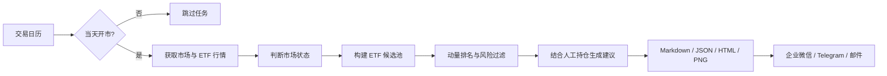

<div align="center">

# mom-select

面向人工复核的 ETF 动量轮动信号生成器

[](https://github.com/nekoimi/mom-select/actions/workflows/docker.yml)
[](https://www.python.org/)
[](https://hub.docker.com/r/nekoimi/mom-select)
[](LICENSE)

[功能特性](#功能特性) · [快速开始](#快速开始) · [配置说明](#配置说明) · [部署与运维](#部署与运维) · [参与贡献](#参与贡献)

</div>

`mom-select` 从聚宽策略中提取市场状态判断和 ETF 动量选择逻辑，使用公开行情生成 Markdown、JSON、HTML 和 PNG 报告。它只提供供人工复核的策略建议，**不连接证券账户，也不会自动下单**。

> [!IMPORTANT]
> 本项目仅供策略研究和技术交流，不构成任何投资建议。使用者应自行核对公告、停牌、涨跌停、溢价率、申赎状态和实际成交条件，并独立承担决策风险。

## 功能特性

- **双运行模式**：支持 13:05 盘中信号和收盘复盘。
- **市场状态判断**：根据四个市场指数与 MA10 的关系识别正常期和走弱期。
- **动态 ETF 池**：结合固定池、全市场发现、流动性和产品名称规则构建候选池。
- **动量排名**：计算 25 日加权趋势、年化收益和 R²，并执行量能、跌幅和流动性过滤。
- **多格式报告**：一次生成 Markdown、JSON、HTML 和 PNG，便于阅读和系统集成。
- **多级数据回退**：历史日线按东方财富、腾讯、Yahoo、AKShare 的顺序回退。
- **离线复盘**：行情按证券缓存为 CSV，可使用已有缓存重建历史结果。
- **消息通知**：支持企业微信机器人、Telegram Bot 和 SMTP 邮件。
- **可靠调度**：APScheduler 配合 AKShare 中国交易日历，仅在交易日执行正式任务。
- **容器化部署**：提供预装 Chromium 和中文字体的 Docker 镜像及 Compose 配置。

## 工作流程



## 快速开始

### 使用 Docker Compose（推荐）

运行环境需要 Docker Engine 和 Docker Compose v2。

```bash
git clone https://github.com/nekoimi/mom-select.git
cd mom-select

cp config/config.example.yaml config/config.yaml
cp config/portfolio.example.csv config/portfolio.csv
cp .env.example .env

docker compose up -d
```

Compose 默认使用 [`ghcr.io/nekoimi/mom-select:latest`](https://github.com/nekoimi/mom-select/pkgs/container/mom-select)，并将行情缓存、报告和市场状态保存在 Docker volumes 中。

查看运行日志：

```bash
docker compose logs -f --tail=200 mom-select
```

立即生成 DEBUG 报告并测试通知链路：

```bash
docker compose run --rm mom-select \
  --config /app/config/config.yaml --run-once --debug
```

### 本地运行

需要 Python 3.12+ 和 [uv](https://docs.astral.sh/uv/)。若系统没有 Chrome 或 Edge，还需安装 Playwright Chromium。

```bash
git clone https://github.com/nekoimi/mom-select.git
cd mom-select

uv sync --dev
uv run playwright install chromium
cp config/portfolio.example.csv config/portfolio.csv
```

常用命令：

```bash
# 生成当前交易日 13:05 盘中信号
uv run mom-select

# 生成收盘复盘
uv run mom-select --mode close

# 固定策略时间为当日 13:05，用于本地流程检查
uv run mom-select --debug

# 指定人工维护的持仓文件
uv run mom-select --portfolio config/portfolio.csv

# 使用本地缓存复查历史收盘信号
uv run mom-select --mode close --offline \
  --date 2026-08-11 --no-save-state
```

报告默认写入 `reports/`，行情缓存默认写入 `data/cache/`。持仓文件可以为空或只保留 CSV 表头，此时程序按空仓处理。

## 配置说明

复制示例文件后再修改生产配置，避免将密钥提交到仓库：

```bash
cp config/config.example.yaml config/config.yaml
cp config/portfolio.example.csv config/portfolio.csv
cp .env.example .env
```

主要配置分组：

| 分组 | 用途 |
|---|---|
| `runtime` | 并发数、项目目录和是否仅使用固定 ETF 池 |
| `schedule` | 时区、触发星期、小时、分钟和误触发宽限 |
| `strategy` | 动量窗口、过滤阈值、持仓数和防御 ETF |
| `paths` | ETF 池、持仓、缓存、报告和市场状态文件路径 |
| `notifications` | 通知总开关和企业微信、Telegram、邮件渠道 |

完整示例见 [`config/config.example.yaml`](config/config.example.yaml)。敏感字段使用环境变量引用：

```yaml
notifications:
  enabled: true
  channels:
    - type: wechat
      name: default
      webhook: ${WECHAT_WEBHOOK}
```

对应密钥填写到 `.env`：

```dotenv
WECHAT_WEBHOOK=https://qyapi.weixin.qq.com/cgi-bin/webhook/send?key=...
```

支持的通知渠道：

- 企业微信机器人：依次发送文本和 PNG 图片；机器人图片限制为 2 MiB。
- Telegram Bot：支持 HTTP、HTTPS 和 SOCKS5 代理。
- SMTP 邮件：支持 SSL 或 STARTTLS，并将 PNG 作为附件发送。

通知发送的每个阶段都会写入日志，但不会输出 webhook、Token 或密码。

## 数据源与缓存

| 数据 | 首选来源 | 回退来源 |
|---|---|---|
| 历史日线 | 东方财富 | 腾讯 → Yahoo → AKShare |
| 13:05 实时快照 | 腾讯 | 数据不足时降低覆盖率并将报告标为不可执行 |
| 全市场 ETF 清单 | 东方财富 | 东方财富基金清单 → 本地缓存 |
| 中国交易日历 | AKShare | 本地日历缓存 |

交易日历缓存在 `data/cache/_trading_calendar.csv`。网络更新失败时会使用本地缓存；网络和缓存均不可用，或日历尚未覆盖目标日期时，正式调度会安全跳过，避免在未知日期误发信号。

公开接口可能限流、变更或中断。长期生产使用建议接入稳定、合规的授权数据源。

## 部署与运维

### 容器镜像

项目同时发布两个内容相同的镜像：

- GHCR：[`ghcr.io/nekoimi/mom-select:latest`](https://github.com/nekoimi/mom-select/pkgs/container/mom-select)
- Docker Hub：[`nekoimi/mom-select:latest`](https://hub.docker.com/r/nekoimi/mom-select)

```bash
docker pull ghcr.io/nekoimi/mom-select:latest
# 或
docker pull nekoimi/mom-select:latest
```

镜像已包含 Python、uv、Playwright Chromium、中文字体和浏览器运行库。容器以 `uv run --frozen --no-sync` 启动，运行期间不会重新解析或下载 Python 依赖。

Compose 使用 Docker `json-file` 日志驱动，单文件最大 10 MiB，最多保留 5 个文件。所有调度、数据获取、报告生成和通知异常都会输出到标准输出或标准错误，可通过 `docker compose logs` 查看。

### APScheduler

默认在 `Asia/Shanghai` 时区的周一至周五 13:05 触发，并在实际执行前检查中国交易日历。正式任务不会在休市日运行；`--run-once --debug` 不受交易日历限制，便于节假日排查报告和通知链路。

### Supervisor

不使用 Docker 时，可以使用 APScheduler 配合 Supervisor 常驻运行。完整步骤见 [`deploy/README.md`](deploy/README.md)。

## 项目结构

```text
mom_select/                 核心业务代码
  cli.py                    CLI 编排与运行入口
  data.py                   行情适配、回退和缓存
  calendar.py               中国交易日历
  strategy.py               市场判断、指标与目标选择
  universe.py               固定池和动态池构建
  reporting.py              Markdown/JSON/HTML/PNG 报告
  notifications.py          企业微信、Telegram 和邮件通知
scripts/
  mom_select_scheduler.py   APScheduler 常驻调度入口
config/                     配置、ETF 池和持仓示例
deploy/                     Supervisor 部署文件
tests/                      pytest 测试
original.py                 原始聚宽回溯模板（保持不修改）
```

## 开发

安装开发依赖并运行检查：

```bash
uv sync --dev
uv run ruff check .
uv run pytest
```

GitHub Actions 会对 Pull Request 执行 Ruff 和依赖安全审查。Docker 镜像通过 Actions 页面手动触发构建，并同时推送到 GHCR 和 Docker Hub；Dependabot 每周检查 Python 依赖和 Actions 版本。

## 参与贡献

Issue 和 Pull Request 都欢迎。提交修改前请：

1. 先搜索 [Issues](https://github.com/nekoimi/mom-select/issues)，确认没有重复问题。
2. 对行为变更补充或更新测试。
3. 运行 Ruff 和完整 pytest 测试。
4. 不要提交 `.env`、真实持仓、通知密钥或账户信息。
5. 保持 `original.py` 不变，以便与原始策略逻辑对照。

报告 Bug 时建议附上运行模式、目标日期、Python 或镜像版本及脱敏后的完整日志。

## 已知限制

- 历史回放使用当前可见 ETF 清单，存在幸存者偏差。
- 腾讯和 Yahoo 的部分日线不直接提供成交额，项目会使用 OHLC 均价乘成交量估算，并在报告中提示。
- 盘中信号基于未完成交易日数据，收盘前价格和排名仍可能变化。
- 本项目不检查所有公告、停牌、涨跌停、实时溢价和申赎限制，执行前必须人工核对。

## 许可证

本项目采用 [GNU Affero General Public License v3.0](LICENSE) 开源。分发、修改或通过网络提供本项目衍生服务时，请遵守 AGPL-3.0 的源代码公开要求。
